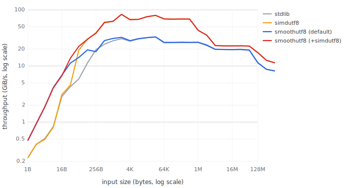
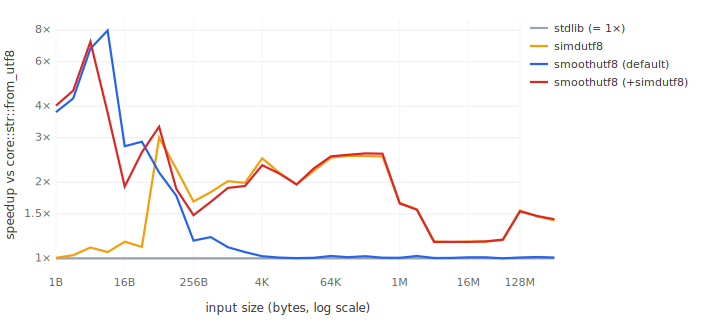

# Benchmarks

Per-architecture throughput tables and methodology. The README carries a short summary; this file has the detail.

## Methodology

All numbers are 250-sample criterion medians on dedicated bare-metal AWS instances (one whole physical box; no noisy-neighbour variance), turbo disabled, governor pinned to `performance`, the SMT sibling of the pinned core offlined, background services stopped. Builds use `lto = true`, `codegen-units = 1`, `-Cllvm-args=-align-all-nofallthru-blocks=6` (64-byte alignment for jump-only block targets) and `-align-loops=32` (32-byte alignment for fallthrough-entered loop headers). Both are needed to neutralise the DSB µop-cache layout lottery on Intel: the 28-byte SWAR ASCII loop is small enough that whichever inlined copy's header lands at a 32 B boundary fits in one DSB window and runs ~35% faster than a copy that straddles, and the SWAR loop is fallthrough-entered so the nofallthru flag alone does not align it.

Even with all of that, run-to-run reproducibility is ~±5%; deltas inside that band are not meaningful. Reproduce with `cargo bench --bench throughput`. The raw criterion stdout for every run ID cited below is tracked in `doc/bench-runs/` in the repository (the directory is excluded from the published crate to keep the package small).

The columns:

- `verify` — `smoothutf8::verify` (safe; overlapping in-bounds tail loads).
- `slack` — `unsafe smoothutf8::verify_with_slack` (the eps-copy over-read path; one masked load for sub-8-byte ranges).
- `SlackBuf` — `SlackBuf::verify` (safe; one combined range assert per call on top of `slack`).
- `core::str` — `core::str::from_utf8(b).is_ok()`.
- `simdutf8` — `simdutf8::basic::from_utf8(b).is_ok()`.

## 0.2.2 tail rewrite: before/after A/B (Sapphire Rapids)

Same-box criterion compare run (`doc/bench-runs/run-20260628T200204Z-4`, spot `c7i.metal-24xl`, baseline = 0.2.2 pre-rewrite, default x86-64 build, no `simdutf8`): replacing the stack-copy tail with overlapping in-bounds loads. Medians, ns/call, ASCII input:

| size | `verify` before | `verify` after | × | `slack` before | `slack` after | `SlackBuf` before | `SlackBuf` after |
|--:|--:|--:|--:|--:|--:|--:|--:|
| 1 | 8.80 | 1.76 | 5.0 | 1.65 | 1.06 | 2.20 | 1.21 |
| 2 | 9.63 | 1.83 | 5.3 | 1.68 | 1.05 | 2.20 | 1.21 |
| 4 | 8.78 | 1.49 | 5.9 | 1.69 | 1.06 | 2.20 | 1.22 |
| 8 | 2.17 | 2.23 | — | 1.41 | 1.06 | 2.05 | 1.32 |

Multibyte input at 2–4 B improves 2.4–2.6× on the safe path (12.7 → 4.8 ns at 2 B) because the short ladder reaches the DFA without the copy. Sizes 16–256 are unchanged within the ±5% floor on every smoothutf8 series, and the `core::str` control reads no-change across the board (one +8.8% blip at ascii/16 — treat sub-±9% deltas in this run accordingly). The slack-path gains are a side effect of the rewrite (no trait dispatch, empty-check moved off the hot path), not the window itself. The safe `verify` now beats `core::str::from_utf8` at every measured size, including 1–7 B where it previously lost by ~2×.

Two provenance caveats. First, this A/B's candidate carried a 16-byte-pair residual loop that was later replaced by the plain 8-byte word loop after it regressed Neoverse-V2 (see the Graviton4 section); at every size in this table the two shapes execute equivalent code on x86-64, so the comparison stands. Second, absolute sub-2 ns numbers do not transfer between boxes: the same binary that measures `slack` at 1.06 ns here reads 1.37 ns on the box behind the tables below — cross-box code-layout and frequency effects exceed the same-box ±5% floor at this scale. Trust the ratios within one run and one box; the tables below are one box's snapshot.

The tables below predate the 0.2.2 tail rewrite for the `verify` series; their short-size `verify` rows are superseded by the "after" column above.

## Sapphire Rapids (`c7i.metal-24xl`, default x86-64 build)

ASCII input, ns/call:

| size | `verify` | `slack` | `SlackBuf` | `core::str` | `simdutf8` | slack÷std | slack÷simd |
|--:|--:|--:|--:|--:|--:|--:|--:|
| 1 | 1.76 | 1.37 | 1.33 | 3.98 | 3.99 | 0.34 | 0.34 |
| 2 | 1.84 | 1.37 | 1.34 | 4.59 | 4.55 | 0.30 | 0.30 |
| 4 | 1.49 | 1.40 | 1.33 | 7.05 | 7.16 | 0.20 | 0.20 |
| 8 | 2.23 | 1.37 | 1.31 | 8.23 | 7.96 | 0.17 | 0.17 |
| 16 | 2.54 | 1.84 | 2.07 | 5.05 | 4.69 | 0.36 | 0.39 |
| 32 | 2.99 | 2.42 | 2.76 | 6.91 | 6.39 | 0.35 | 0.38 |
| 64 | 5.07 | 4.62 | 4.58 | 10.09 | 3.94 | 0.46 | 1.17 |
| 128 | 6.58 | 5.91 | 5.94 | 10.60 | 5.26 | 0.56 | 1.12 |

0.2.2, `run-20260628T221756Z-4` (default build, which 0.2.3 does not change; `simdutf8` column from the same run's dev-dependency series). On this box the `SlackBuf` range assert costs nothing measurable against `slack` — at sub-2 ns scales, cross-run code-layout effects are of the same order as one assert.

## Graviton4 (`c8g.metal-24xl`, Neoverse-V2, default aarch64 build)

ASCII input, ns/call:

| size | `verify` | `slack` | `SlackBuf` | `core::str` | `simdutf8` | slack÷std | slack÷simd |
|--:|--:|--:|--:|--:|--:|--:|--:|
| 1 | 1.32 | 0.94 | 1.05 | 2.26 | 2.63 | 0.42 | 0.36 |
| 2 | 1.42 | 0.94 | 1.07 | 2.86 | 3.01 | 0.33 | 0.31 |
| 4 | 1.27 | 0.94 | 1.05 | 3.75 | 3.81 | 0.25 | 0.25 |
| 8 | 1.71 | 1.13 | 1.14 | 5.29 | 5.49 | 0.21 | 0.21 |
| 16 | 2.07 | 1.34 | 1.53 | 3.01 | 3.02 | 0.45 | 0.44 |
| 32 | 1.88 | 1.50 | 1.79 | 3.39 | 3.42 | 0.44 | 0.44 |
| 64 | 2.29 | 2.03 | 2.26 | 4.87 | 3.61 | 0.42 | 0.56 |
| 128 | 3.70 | 3.06 | 3.40 | 6.00 | 4.04 | 0.51 | 0.76 |

0.2.2, `run-20260628T230402Z-4` (default build, which 0.2.3 does not change; `simdutf8` column from `run-20260628T221815Z-4` on the same instance class, same day). Versus 0.2.1, `verify` at 1–4 B improves 3–5.6× and `slack`/`SlackBuf` improve or hold at every size; `verify` at 8–128 B gives back 10–20% — the cost of the short-range dispatch branch and the larger inlined body on this core — which the same-box three-way A/B in `doc/bench-runs/run-20260628T230402Z-4` quantifies. A 16-byte-pair residual loop variant was tried and rejected: it regressed Neoverse ascii throughput 10–40% at 8–128 B (see CHANGELOG).

The aarch64 build uses a 32 B/iter NEON `umaxv` ASCII scan (LLVM lowers it to `ldp q0,q1; orr; umaxv; tbnz #7`). The shift-DFA multibyte path needs no NEON: A64 `lsr` already takes the shift amount mod 64, so LLVM elides the intermediate `& 63` masks in the unrolled loop and the on-chain latency is one cycle per step — the same as BMI2's `shrx` on x86.

## What the curves look like

The shape follows from where the work is and what bounds it at each input size. The two properties the curves are meant to demonstrate: every smoothutf8 entry point beats `core::str::from_utf8` by 2–5× in the short-string regime, and the `simdutf8` delegation takes over exactly where the SIMD kernel starts winning.

- **1–32 B (the short-string regime).** Per-call fixed cost dominates per-byte work. `verify_with_slack` covers a sub-8-byte range with one masked load and has no runtime CPU dispatch. `SlackBuf::verify` adds one combined range assert, whose cost (0–0.7 ns) is at or below the cross-run layout noise at this scale. `verify` (safe) covers 2–7 B with an overlapping load pair and 8+ B tails with the last-8-byte window — the stack-copy tail it paid here before 0.2.2 (a libc `memcpy` call at 1–7 B) is gone, so the safe path now tracks the slack path closely on short input (see the A/B table above). All three sit 2–5× below `core::str` and raw `simdutf8` here, on both architectures.
- **32–128 B (the crossing).** The SIMD kernel's per-call fixed costs amortize away through this band: at 32 B raw `simdutf8` costs 2.4× the verified path (6.2 vs 2.6 ns), at 64 B the verified-with-AVX2 path still leads (3.04 vs 3.36 ns), and by 128 B `simdutf8` is ahead. The delegation threshold (128 B on x86-64) sits in that crossing — chosen against the `+simdutf8` build's own verified path, not the default build's. On aarch64 the threshold is 64 B, set by the multibyte shapes, where simdutf8's NEON kernel overtakes earliest (see the 0.2.1 changelog); on pure ASCII that trades a little at 64–127 B for the larger multibyte win. Just above the threshold the delegated path carries ~1 ns of threshold-branch plus outlined-call overhead over calling simdutf8 directly (5.6 vs 4.7 ns at 128 B); that fixed cost is the price of protecting short inputs and disappears as a fraction of total within a few hundred bytes.
- **128 B – ~32 KiB (L1-resident, compute-bound).** Throughput is set by instructions per byte. The default build's verified scalar loop plateaus alongside stdlib (which auto-vectorizes its ASCII fast path to the same width); a `+simdutf8` build runs simdutf8's Keiser–Lemire kernel here and matches its curve.
- **~32 KiB – L3 (cache step-downs).** All implementations slow together; relative ordering is unchanged.
- **Beyond L3 (DRAM-bound).** Throughput is set by memory bandwidth, not the validator. Curves converge towards a common floor.

### Default vs `+simdutf8` below the threshold

Below the delegation threshold both builds run the same verified source, but not the same machine code, so the curves are close rather than identical. Three mechanisms separate them. First, `-C target-feature=+avx2` swaps the ASCII prefix scan from the 16-byte SWAR loop to the 32-byte AVX2 scan and re-selects instructions throughout — which is why the `+simdutf8` build is 25–35% *faster* at 64–127 B, and 0.3–1.2 ns slower at 8–16 B, where the wider scan's step granularity does not yet pay (the x86 analogue of the documented NEON trade-off on aarch64). Second, the threshold compare itself exists only with the feature enabled. Third, the delegation call used to drag the entry points past LLVM's inline-cost threshold, adding a 1–3 ns call boundary to every short input — that was the 2× gap in the 0.2.2 plots, fixed in 0.2.3 by outlining the delegation (`#[cold] #[inline(never)]`); below 8 B the remaining deltas are 0.1–0.3 ns with no consistent sign (in the cited run: `verify` +18% at 4 B, `slack` −7% at 2–4 B, `SlackBuf` +8–18% at 1–4 B) — two different binaries' code layout, not a call boundary. What holds after 0.2.3: enabling the feature costs at most ~1.2 ns at any sub-threshold size, and buys 25–35% at 64–127 B plus the full SIMD curve above the threshold.

## Full-sweep plots

Sapphire Rapids, 0.2.3 (`run-20260629T192815Z-4`), full 1 B – 8 MiB ASCII sweep. The `+simdutf8` curve tracks the default curve at the short end (the 0.2.2 plots showed a 2× gap below 64 B from the inline-cost regression fixed in 0.2.3), overtakes it from 64 B via the AVX2 prefix scan, and joins simdutf8's curve above the 128 B delegation threshold.

ASCII input. `stdlib` is `core::str::from_utf8`; `simdutf8` is `simdutf8::basic::from_utf8`. The `+simdutf8` build is `--features simdutf8` with `-C target-feature=+avx2`. Raw data is in [`throughput-data.csv`](throughput-data.csv); plots regenerated by `python3 doc/gen-throughput-svg.py doc/throughput-data.csv > doc/throughput.svg` (and the `-relative` variant).
